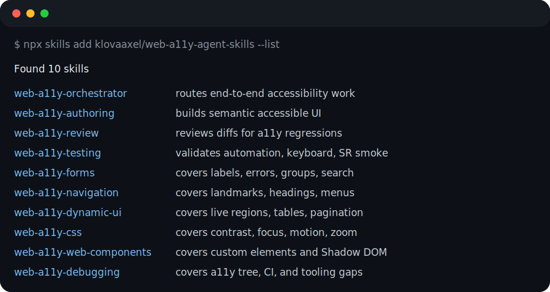

# Web A11y Agent Skills

[](LICENSE)


Framework-agnostic web accessibility skills and Cursor subagents for AI coding agents.

This library helps agents plan, build, review, remediate, and validate accessible frontend work across semantic HTML, keyboard/focus behavior, forms, navigation, dynamic UI, CSS user preferences, web components, and accessibility testing.

## Status

Public preview. Skill names and install flow may still change before 1.0.

## Trust Signals

- MIT licensed, plain Markdown skills, and no runtime dependency required by the skills themselves.
- Compatible with Cursor skills and subagents.
- Compatible with Claude Code through `~/.claude/skills` and `~/.claude/agents` installers.
- Compatible with GitHub Copilot through `.github/skills` and `.github/prompts` installers.
- Compatible with OpenCode through `~/.config/opencode/skills` and `~/.config/opencode/agents` installers.
- Includes 10 portable skills, 5 Cursor subagents, 5 Claude Code subagents, 5 OpenCode subagents, and a Copilot prompt workflow.
- Includes a small changelog, an example agent output, and a terminal-style skill list screenshot.

## Use Cases

### Build Accessible UI

- Skill: `web-a11y-authoring`
- Install:

```bash
npx skills@latest add klovaaxel/web-a11y-agent-skills/skills/web-a11y-authoring
```

### Review A PR

- Skill: `web-a11y-review`
- Install:

```bash
npx skills@latest add klovaaxel/web-a11y-agent-skills/skills/web-a11y-review
```

### Fix Known Defects

- Skill: `web-a11y-orchestrator`
- Install:

```bash
npx skills@latest add klovaaxel/web-a11y-agent-skills/skills/web-a11y-orchestrator
```

### Validate A Flow

- Skill: `web-a11y-testing`
- Install:

```bash
npx skills@latest add klovaaxel/web-a11y-agent-skills/skills/web-a11y-testing
```

### Handle Forms, Navigation, And Dynamic UI

- Skills: `web-a11y-forms`, `web-a11y-navigation`, `web-a11y-dynamic-ui`
- Install:

```bash
npx skills@latest add klovaaxel/web-a11y-agent-skills/skills/web-a11y-forms
npx skills@latest add klovaaxel/web-a11y-agent-skills/skills/web-a11y-navigation
npx skills@latest add klovaaxel/web-a11y-agent-skills/skills/web-a11y-dynamic-ui
```

### Debug Tricky Accessibility Issues

- Skill: `web-a11y-debugging`
- Install:

```bash
npx skills@latest add klovaaxel/web-a11y-agent-skills/skills/web-a11y-debugging
```

## What's Included

### Skills (10)

`web-a11y-orchestrator`, `web-a11y-authoring`, `web-a11y-review`, `web-a11y-testing`, `web-a11y-forms`, `web-a11y-navigation`, `web-a11y-dynamic-ui`, `web-a11y-css`, `web-a11y-web-components`, `web-a11y-debugging`.

### Cursor Subagents (5)

`a11y-orchestrator`, `a11y-component-writer`, `a11y-code-reviewer`, `a11y-remediator`, `a11y-test-driver`.

## Compatibility Matrix

| Platform | Skills | Agents/Prompts | Install |
| --- | --- | --- | --- |
| Cursor | Yes | Subagents | `node scripts/install-cursor-agents.mjs` |
| Claude Code | Yes | Subagents | `node scripts/install-claude-skills.mjs` and `node scripts/install-claude-agents.mjs` |
| GitHub Copilot | Yes | Prompt workflows | `node scripts/install-copilot-assets.mjs /path/to/project` |
| OpenCode | Yes | Subagents | `node scripts/install-opencode-skills.mjs` and `node scripts/install-opencode-agents.mjs` |

## Install Skills

The recommended install path is the open agent skills CLI. It discovers `skills/*/SKILL.md` in this repository.

```bash
npx skills add klovaaxel/web-a11y-agent-skills -a cursor -g --skill '*'
```

List available skills without installing:

```bash
npx skills add klovaaxel/web-a11y-agent-skills --list
```



Install from a local checkout:

```bash
npx skills add . -a cursor -g --skill '*'
```

For project-local installation, omit `-g`:

```bash
npx skills add . -a cursor --skill '*'
```

## Install Cursor Subagents

Cursor subagents are not part of the portable Agent Skills standard, so install them separately:

```bash
node scripts/install-cursor-agents.mjs
```

Use symlinks during development:

```bash
node scripts/install-cursor-agents.mjs --symlink
```

By default, the script installs to `~/.cursor/agents`. Override with:

```bash
WEB_A11Y_AGENT_SKILLS_AGENT_DIR=/path/to/agents node scripts/install-cursor-agents.mjs
```

## Install Claude Code Skills And Subagents

Claude Code can use the same `SKILL.md` directories. Install skills and Claude-specific subagents with:

```bash
node scripts/install-claude-skills.mjs
node scripts/install-claude-agents.mjs
```

Use symlinks during development:

```bash
node scripts/install-claude-skills.mjs --symlink
node scripts/install-claude-agents.mjs --symlink
```

By default, the scripts install to `~/.claude/skills` and `~/.claude/agents`. Override with:

```bash
WEB_A11Y_AGENT_SKILLS_CLAUDE_SKILLS_DIR=/path/to/skills node scripts/install-claude-skills.mjs
WEB_A11Y_AGENT_SKILLS_CLAUDE_AGENT_DIR=/path/to/agents node scripts/install-claude-agents.mjs
```

## Install GitHub Copilot Skills And Prompts

GitHub Copilot can use the skills as project-local agent skills and the prompt workflow as a reusable prompt file:

```bash
node scripts/install-copilot-assets.mjs /path/to/project
```

This installs skills to `/path/to/project/.github/skills` and prompt files to `/path/to/project/.github/prompts`.

Override the target project with an environment variable:

```bash
WEB_A11Y_AGENT_SKILLS_COPILOT_PROJECT_DIR=/path/to/project node scripts/install-copilot-assets.mjs
```

## Install OpenCode Skills And Subagents

OpenCode can use the same `SKILL.md` directories plus native markdown subagents:

```bash
node scripts/install-opencode-skills.mjs
node scripts/install-opencode-agents.mjs
```

Use symlinks during development:

```bash
node scripts/install-opencode-skills.mjs --symlink
node scripts/install-opencode-agents.mjs --symlink
```

By default, the scripts install to `~/.config/opencode/skills` and `~/.config/opencode/agents`. Override with:

```bash
WEB_A11Y_AGENT_SKILLS_OPENCODE_SKILLS_DIR=/path/to/skills node scripts/install-opencode-skills.mjs
WEB_A11Y_AGENT_SKILLS_OPENCODE_AGENT_DIR=/path/to/agents node scripts/install-opencode-agents.mjs
```

## Suggested Agent Workflow

Use these roles as a loop:

1. Ask `a11y-orchestrator` to identify the relevant accessibility passes.
2. Ask `a11y-component-writer` to implement the component or page.
3. Ask `a11y-code-reviewer` to review the changed UI.
4. Ask `a11y-remediator` to fix confirmed defects.
5. Ask `a11y-test-driver` to validate automation, keyboard, and screen reader smoke paths.

## Example Output

See [`docs/example-output.md`](docs/example-output.md) for an example `a11y-code-reviewer` response.

## Changelog

See [`CHANGELOG.md`](CHANGELOG.md).

## Public Source Basis

These skills synthesize public web accessibility practice. Useful public references include:

- W3C WCAG
- WAI Tutorials
- WAI-ARIA Authoring Practices Guide
- MDN Web Docs
- WebAIM articles and tools
- axe and browser DevTools documentation

## Acknowledgements

This project is strongly influenced by *Web Accessibility Cookbook* by Manuel Matuzovic (O'Reilly). The book helped shape the skill pack's practical focus on real frontend patterns, implementation trade-offs, and verification workflows.

These skills are original agent workflows and are not a substitute for the book. If you want the complete recipes, examples, and explanations, buy or read the original work.

## License

MIT
